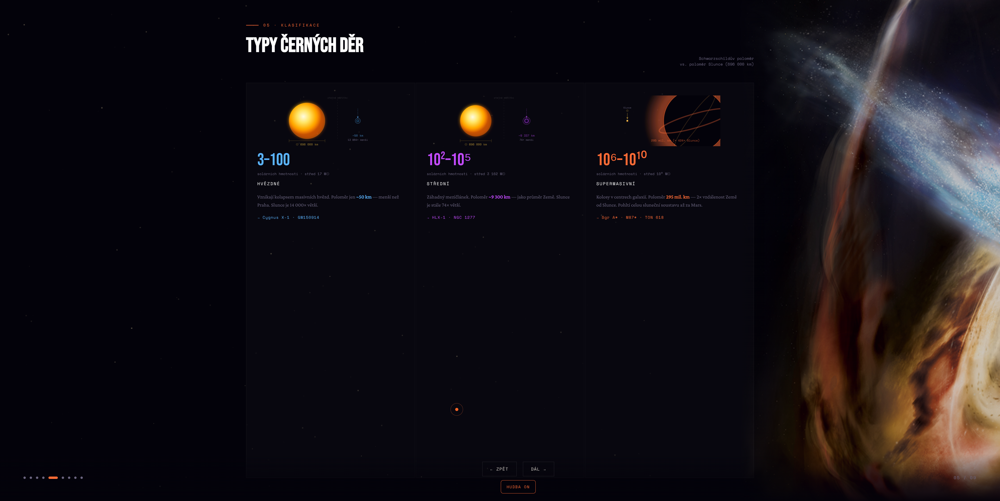

# BlackHoleEdu Offline Template

Cinematic slide-based web presentation template with bilingual CZ/EN support, ambient audio, and offline-ready packaging.

## License

This template is released under the MIT License.
You can use, modify, and redistribute presentations made with it.

## What's Included

- `index.html` - main presentation page
- `images/slides/*` - slide background images
- `ambient-1.mp3`, `ambient-2.mp3` - ambient music tracks
- `assets/preview.png` - project preview image
- `LICENSE` - MIT license text

## Run Offline

1. Download and extract the offline ZIP package.
2. Open `index.html` in your browser.
3. If audio autoplay is blocked, press `Play` once.

No internet connection is required after extraction.

## Language

- Czech and English are both included.
- Switch language with the `CZ` / `EN` toggle.
- URL query also works: `?lang=cs` or `?lang=en`.

## Attribution Notes

- Music was generated with Suno (Pro account). Usage remains subject to Suno Terms.
- Image source references are documented in `images/slides/README.md` (NASA/ESA/open sources).

## Author

Created by [Drok Rhys](https://github.com/DrokRhys) at [Magio Studios](https://magiostudios.com).
Join the community on [Patreon](https://patreon.com/magiostudios).
